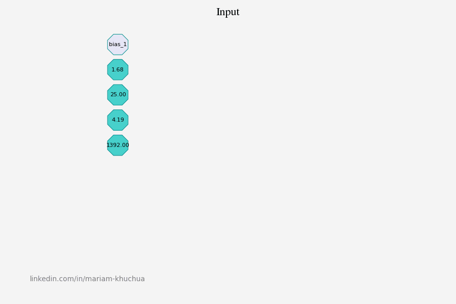

# Explainable AI Visualizations


## Overview

Explainable AI Visualizations is a project that aims to provide visualizations to enhance the interpretability and understanding of AI models. The goal is to make complex models more transparent and explainable to both technical and non-technical users.

## Features

Generate GIFs from fully connected neural network models, like this one



## Getting Started

To get started with the project, follow these steps:

#### 1. Clone the repository to your local machine

```git clone https://github.com/mariamkhuchua/ai-explainable-visualizations.git```

#### 2. Create a Python virtial environment within the repository
```
virtualenv -p /usr/bin/python3.10 venv
source /venv/bin/activate
```
#### 3. Install required libraries
   
```pip install -r requirements.txt ```

#### 4. Check out the [Jupyter notebooks](../notebooks) folder
Run the notebook code as is or modify it for training and visualizing your own models.
